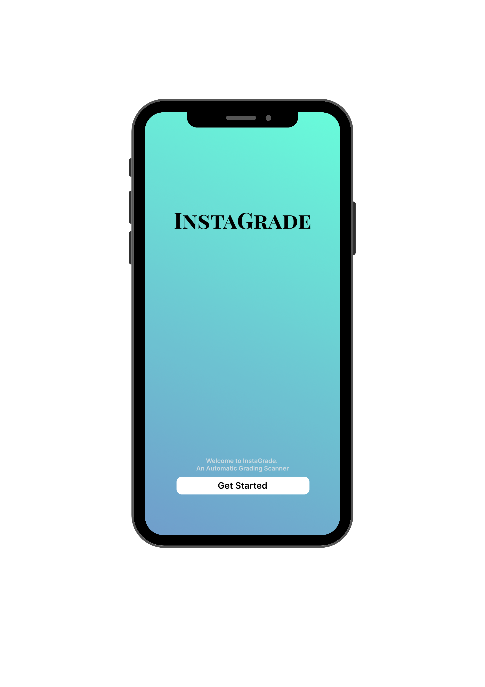
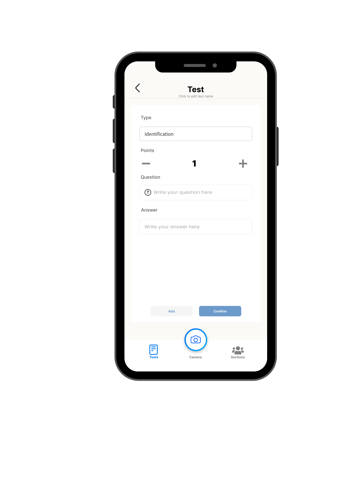

# InstaGrade: An Automated Grading Scanner Using Text Recognition

---

InstaGrade is developed using Flutter (Dart) and is a final project for our mobile application course.  
This project helps teachers efficiently grade students' identification answers just by scanning them into the students' answer sheets.  
The goal is to reduce the workload of teachers and simplify the grading of each student's papers.  

---

## 📸 Sample UI

  
  
  
  

---
